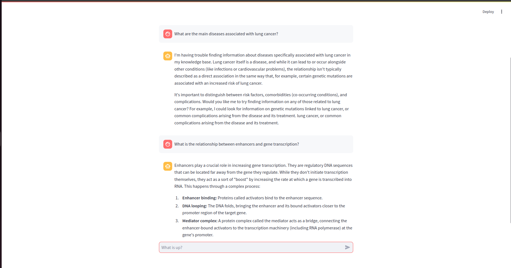

# Neo4j LLM Chatbot

Welcome to the Neo4j LLM Chatbot! This application leverages the power of LangChain and Neo4j to provide an interactive chatbot experience. Currently connected to the BioCypher knowledge graph (BioCypherKG), our chatbot is designed to offer detailed responses across various domains, utilizing agents to handle specific tasks effectively.

## Features

### Conversational Interface:
Engage in natural conversations and receive accurate information across diverse topics, not limited to movies.

### Dynamic Query Handling:
Utilizes Neo4j's graph database capabilities to answer questions based on various schemas, including nodes and relationships in the database.

### Agent Architecture:
- **General Agent**: Handles broad queries and general user interactions.
- **Entity Extraction Agent**: Extracts and identifies entities within user queries for more focused responses.
- **Information Agent**: Provides detailed information and insights based on extracted entities and relationships.

### Tool Integration:
Equipped with various tools for general conversations and specific queries using Cypher, the query language for Neo4j.

## How It Works

**Chat Setup**: The chatbot initializes with a generalized prompt that defines its role, ready to assist users with a variety of queries across multiple domains.

**Session Management**: Each conversation is tracked, allowing for a personalized user experience.

**Response Generation**: User inputs are processed to generate responses using a powerful language model, ensuring accurate and engaging replies.

## Demo
Below is a screenshot of the chatbot in action:

<div style="display: flex; justify-content: space-between;">
    
    
</div>

## Installation

To get started, clone this repository and install the required dependencies:

```bash
git clone https://github.com/IbnuEyni/neo4j-llm-chatbot-py.git
cd neo4j-llm-chatbot-py
pip install -r requirements.txt
```

## Usage
Run the chatbot using Streamlit:

    streamlit run app.py

Example Interaction

    User: "What are the main diseases associated with lung cancer?"
    Bot: "Enhancers play a crucial role in increasing gene transcription. They are regulatory DNA sequences that can be located far away from the gene they regulate. While they don't initiate transcription themselves, they act as a sort of "boost" by increasing the rate at which a gene is transcribed into RNA."


## Contribution
Contributions are welcome! Please feel free to submit a pull request or open an issue for any enhancements or bugs you find.